# Workflow graph

> **ARCHIVED (docs/09).** This document analyses the earlier n8n export, which the To-Be process diagrams have replaced as the source of truth. It is kept as reference only and is not maintained.

```mermaid
flowchart TD
  5f2f30a1["03 - SBO.02 - Agentic Reasoning Orchestrator"]
  70130b27["05 - SBO.05 - Document Checks"]
  efab0b12["06 - SBO.06 - Business Validation"]
  a0efc12d["07A - SBO.07 - Identity Validation"]
  2bb9a819["07B - SBO.07 - Authority Validation"]
  67285570["09 - SBO.09 - Financial Check"]
  b81c223c["10 - SBO.10 - Final Verification"]
  864cbbcd["12 - SBO.12 - System Data Check"]
  106a2bda["90 - Finalize Decision"]
  6aaf9a78["91 - Human Review Portal"]
  c76a08e5["92 - Resubmission Portal"]
  5c417eef["95 - Evidence Resolution Utility"]
  6c7ec83b["96 - Customer Evidence Upload Portal"]
  5f2f30a1 -->|Tool - Business Validation| e795e09d["ANZ Authorised Representative - Runtime — 06 - SBO.06 - Business Validation"]
  5f2f30a1 -->|Tool - Document Checks| c2c5f8d1["ANZ Authorised Representative - Runtime — 05 - SBO.05 - Document Checks"]
  5f2f30a1 -->|Tool - Identity Validation| b0ae07af["ANZ Authorised Representative - Runtime — 07A - SBO.07 - Identity Validation"]
  5f2f30a1 -->|Tool - Authority Validation| 55ccd0b7["ANZ Authorised Representative - Runtime — 07B - SBO.07 - Authority Validation"]
  5f2f30a1 -->|Tool - System Data Check| 1ea0447f["ANZ Authorised Representative - Runtime — 12 - SBO.12 - System Data Check"]
  5f2f30a1 -->|Tool - Financial Check| d1a10550["ANZ Authorised Representative - Runtime — 09 - SBO.09 - Financial Check"]
  5f2f30a1 -->|Tool - Final Verification| df713a8a["ANZ Authorised Representative - Runtime — 10 - SBO.10 - Final Verification"]
  5f2f30a1 -->|Run Governed Runtime Finalizer| 2a467b2f["ANZ Authorised Representative - Runtime — 90 - Finalize Decision"]
  5f2f30a1 -->|Resolve Customer Evidence| f77c68c1["ANZ Authorised Representative - Runtime — 95 - Evidence Resolution Utility"]
  70130b27 -->|When Executed by Another Workflow| acd14ef5["When Executed by Another Workflow"]
  efab0b12 -->|When Executed by Another Workflow| acd14ef5["When Executed by Another Workflow"]
  a0efc12d -->|When Executed by Another Workflow| acd14ef5["When Executed by Another Workflow"]
  2bb9a819 -->|When Executed by Another Workflow| acd14ef5["When Executed by Another Workflow"]
  67285570 -->|When Executed by Another Workflow| acd14ef5["When Executed by Another Workflow"]
  b81c223c -->|When Executed by Another Workflow| acd14ef5["When Executed by Another Workflow"]
  864cbbcd -->|When Executed by Another Workflow| acd14ef5["When Executed by Another Workflow"]
  106a2bda -->|Receive Finalization Request| 1cd55bb1["Receive Finalization Request"]
  106a2bda -->|Call '90 - Finalize Decision'| 2a467b2f["ANZ Authorised Representative - Runtime — 90 - Finalize Decision"]
  c76a08e5 -->|Run Revised SBO.02 Assessment| 9284d1e6["ANZ Authorised Representative - Runtime — 02 - SBO.02 - Profiling Super Agent"]
  5c417eef -->|Receive Evidence Resolution Request| 8214cdab["Receive Evidence Resolution Request"]
```

## Node-level edges

| Workflow | From | To | Connection |
| --- | --- | --- | --- |
| 03 - SBO.02 - Agentic Reasoning Orchestrator.json | Agentic Chat | Resolve Case Request | main |
| 03 - SBO.02 - Agentic Reasoning Orchestrator.json | Resolve Case Request | Case ID Present? | main |
| 03 - SBO.02 - Agentic Reasoning Orchestrator.json | Get Case Context | Check Case Exists | main |
| 03 - SBO.02 - Agentic Reasoning Orchestrator.json | Check Case Exists | Case Exists? | main |
| 03 - SBO.02 - Agentic Reasoning Orchestrator.json | Case ID Present? | Get Case Context | main |
| 03 - SBO.02 - Agentic Reasoning Orchestrator.json | Case ID Present? | Prepare Invalid Request Response | main |
| 03 - SBO.02 - Agentic Reasoning Orchestrator.json | Case Exists? | Reset Runtime Utility Results | main |
| 03 - SBO.02 - Agentic Reasoning Orchestrator.json | Case Exists? | Prepare Case Not Found Response | main |
| 03 - SBO.02 - Agentic Reasoning Orchestrator.json | Reset Runtime Utility Results | Get Existing Runtime Results | main |
| 03 - SBO.02 - Agentic Reasoning Orchestrator.json | Prepare Agent Context | SBO.02 Agentic Reasoning Super Agent | main |
| 03 - SBO.02 - Agentic Reasoning Orchestrator.json | OpenAI Model - Agent Reasoning | SBO.02 Agentic Reasoning Super Agent | ai_languageModel |
| 03 - SBO.02 - Agentic Reasoning Orchestrator.json | Tool - Business Validation | SBO.02 Agentic Reasoning Super Agent | ai_tool |
| 03 - SBO.02 - Agentic Reasoning Orchestrator.json | Tool - Document Checks | SBO.02 Agentic Reasoning Super Agent | ai_tool |
| 03 - SBO.02 - Agentic Reasoning Orchestrator.json | Tool - Identity Validation | SBO.02 Agentic Reasoning Super Agent | ai_tool |
| 03 - SBO.02 - Agentic Reasoning Orchestrator.json | Tool - Authority Validation | SBO.02 Agentic Reasoning Super Agent | ai_tool |
| 03 - SBO.02 - Agentic Reasoning Orchestrator.json | Tool - System Data Check | SBO.02 Agentic Reasoning Super Agent | ai_tool |
| 03 - SBO.02 - Agentic Reasoning Orchestrator.json | Tool - Financial Check | SBO.02 Agentic Reasoning Super Agent | ai_tool |
| 03 - SBO.02 - Agentic Reasoning Orchestrator.json | Tool - Final Verification | SBO.02 Agentic Reasoning Super Agent | ai_tool |
| 03 - SBO.02 - Agentic Reasoning Orchestrator.json | SBO.02 Agentic Reasoning Super Agent | Prepare Parsing Input | main |
| 03 - SBO.02 - Agentic Reasoning Orchestrator.json | Prepare Parsing Input | Structure Agent Recommendation | main |
| 03 - SBO.02 - Agentic Reasoning Orchestrator.json | OpenAI Model - Output Structuring | Structure Agent Recommendation | ai_languageModel |
| 03 - SBO.02 - Agentic Reasoning Orchestrator.json | Structured Output Parser | Auto-fix Recommendation Format | ai_outputParser |
| 03 - SBO.02 - Agentic Reasoning Orchestrator.json | Structure Agent Recommendation | Normalise Provisional Recommendation | main |
| 03 - SBO.02 - Agentic Reasoning Orchestrator.json | Normalise Provisional Recommendation | Prepare Runtime Finalization Input | main |
| 03 - SBO.02 - Agentic Reasoning Orchestrator.json | Prepare Runtime Finalization Input | Run Governed Runtime Finalizer | main |
| 03 - SBO.02 - Agentic Reasoning Orchestrator.json | Run Governed Runtime Finalizer | Compare Agent and Governed Outcome | main |
| 03 - SBO.02 - Agentic Reasoning Orchestrator.json | Auto-fix Recommendation Format | Structure Agent Recommendation | ai_outputParser |
| 03 - SBO.02 - Agentic Reasoning Orchestrator.json | OpenAI Model - Parser Repair | Auto-fix Recommendation Format | ai_languageModel |
| 03 - SBO.02 - Agentic Reasoning Orchestrator.json | Conversation Memory | SBO.02 Agentic Reasoning Super Agent | ai_memory |
| 03 - SBO.02 - Agentic Reasoning Orchestrator.json | Conversation Memory | Final Chat Response | ai_memory |
| 03 - SBO.02 - Agentic Reasoning Orchestrator.json | Conversation Memory | Ask Customer for Evidence Method | ai_memory |
| 03 - SBO.02 - Agentic Reasoning Orchestrator.json | Conversation Memory | Ask Evidence Method Again | ai_memory |
| 03 - SBO.02 - Agentic Reasoning Orchestrator.json | Conversation Memory | Ask for Text Evidence | ai_memory |
| 03 - SBO.02 - Agentic Reasoning Orchestrator.json | Conversation Memory | Send Cancellation Message | ai_memory |
| 03 - SBO.02 - Agentic Reasoning Orchestrator.json | Conversation Memory | Ask for Text Evidence Again | ai_memory |
| 03 - SBO.02 - Agentic Reasoning Orchestrator.json | Conversation Memory | Send Upload Cancelled | ai_memory |
| 03 - SBO.02 - Agentic Reasoning Orchestrator.json | Conversation Memory | Ask Customer to Complete Upload | ai_memory |
| 03 - SBO.02 - Agentic Reasoning Orchestrator.json | Conversation Memory | Send Evidence Accepted Message | ai_memory |
| 03 - SBO.02 - Agentic Reasoning Orchestrator.json | Conversation Memory | Explain Remaining Evidence Gap | ai_memory |
| 03 - SBO.02 - Agentic Reasoning Orchestrator.json | Conversation Memory | Send Evidence Escalation Message | ai_memory |
| 03 - SBO.02 - Agentic Reasoning Orchestrator.json | Conversation Memory | Send Contradictory Evidence Message | ai_memory |
| 03 - SBO.02 - Agentic Reasoning Orchestrator.json | Build Chat Response | Final Chat Response | main |
| 03 - SBO.02 - Agentic Reasoning Orchestrator.json | Classify Continuation Requirement | Customer Evidence Required? | main |
| 03 - SBO.02 - Agentic Reasoning Orchestrator.json | Customer Evidence Required? | Create Evidence Request | main |
| 03 - SBO.02 - Agentic Reasoning Orchestrator.json | Customer Evidence Required? | Build Chat Response | main |
| 03 - SBO.02 - Agentic Reasoning Orchestrator.json | Create Evidence Request | Upsert row(s) | main |
| 03 - SBO.02 - Agentic Reasoning Orchestrator.json | Upsert row(s) | Update Case to Waiting for Evidence | main |
| 03 - SBO.02 - Agentic Reasoning Orchestrator.json | Update Case to Waiting for Evidence | Select Evidence Channel | main |
| 03 - SBO.02 - Agentic Reasoning Orchestrator.json | Select Evidence Channel | Ask for Text Evidence | main |
| 03 - SBO.02 - Agentic Reasoning Orchestrator.json | Select Evidence Channel | Build Evidence Upload Link | main |
| 03 - SBO.02 - Agentic Reasoning Orchestrator.json | Select Evidence Channel | Ask Customer for Evidence Method | main |
| 03 - SBO.02 - Agentic Reasoning Orchestrator.json | Ask Customer for Evidence Method | Normalise Evidence Method | main |
| 03 - SBO.02 - Agentic Reasoning Orchestrator.json | Normalise Evidence Method | Evidence Method Valid? | main |
| 03 - SBO.02 - Agentic Reasoning Orchestrator.json | Evidence Method Valid? | Route Selected Method | main |
| 03 - SBO.02 - Agentic Reasoning Orchestrator.json | Evidence Method Valid? | Ask Evidence Method Again | main |
| 03 - SBO.02 - Agentic Reasoning Orchestrator.json | Ask Evidence Method Again | Normalise Retry Method | main |
| 03 - SBO.02 - Agentic Reasoning Orchestrator.json | Normalise Retry Method | Retry Method Valid? | main |
| 03 - SBO.02 - Agentic Reasoning Orchestrator.json | Retry Method Valid? | Route Selected Method | main |
| 03 - SBO.02 - Agentic Reasoning Orchestrator.json | Retry Method Valid? | Send Method Selection Failed | main |
| 03 - SBO.02 - Agentic Reasoning Orchestrator.json | Ask for Text Evidence | Normalise Customer Text Evidence | main |
| 03 - SBO.02 - Agentic Reasoning Orchestrator.json | Normalise Customer Text Evidence | Customer Cancelled | main |
| 03 - SBO.02 - Agentic Reasoning Orchestrator.json | Customer Cancelled | Cancel Evidence Request | main |
| 03 - SBO.02 - Agentic Reasoning Orchestrator.json | Customer Cancelled | Text Evidence Received? | main |
| 03 - SBO.02 - Agentic Reasoning Orchestrator.json | Cancel Evidence Request | Send Cancellation Message | main |
| 03 - SBO.02 - Agentic Reasoning Orchestrator.json | Text Evidence Received? | Prepare Text Evidence Record | main |
| 03 - SBO.02 - Agentic Reasoning Orchestrator.json | Text Evidence Received? | Ask for Text Evidence Again | main |
| 03 - SBO.02 - Agentic Reasoning Orchestrator.json | Ask for Text Evidence Again | Normalise Customer Text Evidence | main |
| 03 - SBO.02 - Agentic Reasoning Orchestrator.json | Prepare Text Evidence Record | Store Text Evidence | main |
| 03 - SBO.02 - Agentic Reasoning Orchestrator.json | Store Text Evidence | Mark Text Evidence Received | main |
| 03 - SBO.02 - Agentic Reasoning Orchestrator.json | Mark Text Evidence Received | Audit Text Evidence Received | main |
| 03 - SBO.02 - Agentic Reasoning Orchestrator.json | Route Selected Method | Ask for Text Evidence | main |
| 03 - SBO.02 - Agentic Reasoning Orchestrator.json | Route Selected Method | Build Evidence Upload Link | main |
| 03 - SBO.02 - Agentic Reasoning Orchestrator.json | Build Evidence Upload Link | Ask for Evidence Upload | main |
| 03 - SBO.02 - Agentic Reasoning Orchestrator.json | Ask for Evidence Upload | Normalise Upload Reply | main |
| 03 - SBO.02 - Agentic Reasoning Orchestrator.json | Audit Text Evidence Received | Resolve Customer Evidence | main |
| 03 - SBO.02 - Agentic Reasoning Orchestrator.json | Customer Cancelled Upload? | Cancel Upload Request | main |
| 03 - SBO.02 - Agentic Reasoning Orchestrator.json | Customer Cancelled Upload? | Get Uploaded Evidence | main |
| 03 - SBO.02 - Agentic Reasoning Orchestrator.json | Cancel Upload Request | Update Cancelled Case | main |
| 03 - SBO.02 - Agentic Reasoning Orchestrator.json | Normalise Upload Reply | Customer Cancelled Upload? | main |
| 03 - SBO.02 - Agentic Reasoning Orchestrator.json | Update Cancelled Case | Audit Upload Cancellation | main |
| 03 - SBO.02 - Agentic Reasoning Orchestrator.json | Audit Upload Cancellation | Send Upload Cancelled | main |
| 03 - SBO.02 - Agentic Reasoning Orchestrator.json | Get Uploaded Evidence | Evaluate Upload Availability | main |
| 03 - SBO.02 - Agentic Reasoning Orchestrator.json | Evaluate Upload Availability | Evidence Available? | main |
| 03 - SBO.02 - Agentic Reasoning Orchestrator.json | Evidence Available? | Resolve Customer Evidence | main |
| 03 - SBO.02 - Agentic Reasoning Orchestrator.json | Evidence Available? | Ask Customer to Complete Upload | main |
| 03 - SBO.02 - Agentic Reasoning Orchestrator.json | Ask Customer to Complete Upload | Normalise Upload Reply | main |
| 03 - SBO.02 - Agentic Reasoning Orchestrator.json | Resolve Customer Evidence | Route Evidence Resolution | main |
| 03 - SBO.02 - Agentic Reasoning Orchestrator.json | Update row(s) | Send Evidence Accepted Message | main |
| 03 - SBO.02 - Agentic Reasoning Orchestrator.json | Route Evidence Resolution | Update row(s) | main |
| 03 - SBO.02 - Agentic Reasoning Orchestrator.json | Route Evidence Resolution | If | main |
| 03 - SBO.02 - Agentic Reasoning Orchestrator.json | Route Evidence Resolution | If | main |
| 03 - SBO.02 - Agentic Reasoning Orchestrator.json | Route Evidence Resolution | Create Contradictory Evidence Review | main |
| 03 - SBO.02 - Agentic Reasoning Orchestrator.json | If | Explain Remaining Evidence Gap | main |
| 03 - SBO.02 - Agentic Reasoning Orchestrator.json | If | Create Evidence Review After Max Attempts | main |
| 03 - SBO.02 - Agentic Reasoning Orchestrator.json | Explain Remaining Evidence Gap | Select Evidence Channel | main |
| 03 - SBO.02 - Agentic Reasoning Orchestrator.json | Create Evidence Review After Max Attempts | Update Case After Evidence Escalation | main |
| 03 - SBO.02 - Agentic Reasoning Orchestrator.json | Update Case After Evidence Escalation | Audit Evidence Escalation | main |
| 03 - SBO.02 - Agentic Reasoning Orchestrator.json | Audit Evidence Escalation | Send Evidence Escalation Message | main |
| 03 - SBO.02 - Agentic Reasoning Orchestrator.json | Create Contradictory Evidence Review | Update Contradictory Evidence Case | main |
| 03 - SBO.02 - Agentic Reasoning Orchestrator.json | Update Contradictory Evidence Case | Audit Contradictory Evidence | main |
| 03 - SBO.02 - Agentic Reasoning Orchestrator.json | Audit Contradictory Evidence | Send Contradictory Evidence Message | main |
| 03 - SBO.02 - Agentic Reasoning Orchestrator.json | Get Existing Runtime Results | Prepare Agent Context | main |
| 03 - SBO.02 - Agentic Reasoning Orchestrator.json | Send Evidence Accepted Message | Get Existing Runtime Results | main |
| 03 - SBO.02 - Agentic Reasoning Orchestrator.json | Compare Agent and Governed Outcome | Classify Continuation Requirement | main |
| 05 - SBO.05 - Document Checks.json | When Executed by Another Workflow | Get Mock Utility Result | main |
| 05 - SBO.05 - Document Checks.json | Build Utility Result | Store Utility Result | main |
| 05 - SBO.05 - Document Checks.json | Store Utility Result | Audit Utility Check | main |
| 05 - SBO.05 - Document Checks.json | Get Mock Utility Result | Get Decision Rules | main |
| 05 - SBO.05 - Document Checks.json | Get Decision Rules | Build Utility Result | main |
| 05 - SBO.05 - Document Checks.json | Audit Utility Check | Return Utility Result | main |
| 06 - SBO.06 - Business Validation.json | When Executed by Another Workflow | Get Mock Utility Result | main |
| 06 - SBO.06 - Business Validation.json | Build Utility Result | Store Utility Result | main |
| 06 - SBO.06 - Business Validation.json | Store Utility Result | Audit Utility Check | main |
| 06 - SBO.06 - Business Validation.json | Get Mock Utility Result | Get Decision Rules | main |
| 06 - SBO.06 - Business Validation.json | Get Decision Rules | Build Utility Result | main |
| 06 - SBO.06 - Business Validation.json | Audit Utility Check | Return Utility Result | main |
| 07A - SBO.07 - Identity Validation.json | When Executed by Another Workflow | Get Mock Utility Result | main |
| 07A - SBO.07 - Identity Validation.json | Build Utility Result | Store Utility Result | main |
| 07A - SBO.07 - Identity Validation.json | Store Utility Result | Audit Utility Check | main |
| 07A - SBO.07 - Identity Validation.json | Get Mock Utility Result | Get Decision Rules | main |
| 07A - SBO.07 - Identity Validation.json | Get Decision Rules | Build Utility Result | main |
| 07A - SBO.07 - Identity Validation.json | Audit Utility Check | Return Utility Result | main |
| 07B - SBO.07 - Authority Validation.json | When Executed by Another Workflow | Get Mock Utility Result | main |
| 07B - SBO.07 - Authority Validation.json | Build Utility Result | Store Utility Result | main |
| 07B - SBO.07 - Authority Validation.json | Store Utility Result | Audit Utility Check | main |
| 07B - SBO.07 - Authority Validation.json | Get Mock Utility Result | Get Decision Rules | main |
| 07B - SBO.07 - Authority Validation.json | Get Decision Rules | Build Utility Result | main |
| 07B - SBO.07 - Authority Validation.json | Audit Utility Check | Return Utility Result | main |
| 09 - SBO.09 - Financial Check.json | When Executed by Another Workflow | Get Mock Utility Result | main |
| 09 - SBO.09 - Financial Check.json | Build Utility Result | Store Utility Result | main |
| 09 - SBO.09 - Financial Check.json | Store Utility Result | Audit Utility Check | main |
| 09 - SBO.09 - Financial Check.json | Get Mock Utility Result | Get Decision Rules | main |
| 09 - SBO.09 - Financial Check.json | Get Decision Rules | Build Utility Result | main |
| 09 - SBO.09 - Financial Check.json | Audit Utility Check | Return Utility Result | main |
| 10 - SBO.10 - Final Verification.json | When Executed by Another Workflow | Get Mock Utility Result | main |
| 10 - SBO.10 - Final Verification.json | Build Utility Result | Store Utility Result | main |
| 10 - SBO.10 - Final Verification.json | Store Utility Result | Audit Utility Check | main |
| 10 - SBO.10 - Final Verification.json | Get Mock Utility Result | Get Decision Rules | main |
| 10 - SBO.10 - Final Verification.json | Get Decision Rules | Build Utility Result | main |
| 10 - SBO.10 - Final Verification.json | Audit Utility Check | Return Utility Result | main |
| 12 - SBO.12 - System Data Check.json | When Executed by Another Workflow | Get Mock Utility Result | main |
| 12 - SBO.12 - System Data Check.json | Build Utility Result | Store Utility Result | main |
| 12 - SBO.12 - System Data Check.json | Store Utility Result | Audit Utility Check | main |
| 12 - SBO.12 - System Data Check.json | Get Mock Utility Result | Get Decision Rules | main |
| 12 - SBO.12 - System Data Check.json | Get Decision Rules | Build Utility Result | main |
| 12 - SBO.12 - System Data Check.json | Audit Utility Check | Return Utility Result | main |
| 90 - Finalize Decision.json | Get Case | Prepare Result Source | main |
| 90 - Finalize Decision.json | Get Decision Rules | Determine Final Decision | main |
| 90 - Finalize Decision.json | Receive Finalization Request | Get Case | main |
| 90 - Finalize Decision.json | When clicking ‘Execute workflow’ | Edit Fields | main |
| 90 - Finalize Decision.json | Edit Fields | Call '90 - Finalize Decision' | main |
| 90 - Finalize Decision.json | Get Communication Template | Build Communication | main |
| 90 - Finalize Decision.json | Determine Final Decision | Get Communication Template | main |
| 90 - Finalize Decision.json | Build Communication | Store Final Decision | main |
| 90 - Finalize Decision.json | Store Final Decision | Store Initial Communication | main |
| 90 - Finalize Decision.json | Get Mock Utility Results | Package Mock Utility Results | main |
| 90 - Finalize Decision.json | Store Initial Communication | Prepare Runtime Case Record | main |
| 90 - Finalize Decision.json | Prepare Runtime Case Record | Upsert Runtime Case | main |
| 90 - Finalize Decision.json | Upsert Runtime Case | Return Final Package | main |
| 90 - Finalize Decision.json | Prepare Result Source | Select Result Source | main |
| 90 - Finalize Decision.json | Select Result Source | Get Mock Utility Results | main |
| 90 - Finalize Decision.json | Select Result Source | Get Runtime Utility Results | main |
| 90 - Finalize Decision.json | Package Mock Utility Results | Get Decision Rules | main |
| 90 - Finalize Decision.json | Get Runtime Utility Results | Package Runtime Utility Results | main |
| 90 - Finalize Decision.json | Package Runtime Utility Results | Get Decision Rules | main |
| 91 - Human Review Portal.json | Open Review | Get Review Record | main |
| 91 - Human Review Portal.json | Get Review Record | Check Review Status | main |
| 91 - Human Review Portal.json | Check Review Status | Review Found? | main |
| 91 - Human Review Portal.json | Review Found? | Review Open? | main |
| 91 - Human Review Portal.json | Review Found? | Review Not Found | main |
| 91 - Human Review Portal.json | Review Open? | Get Decision Record | main |
| 91 - Human Review Portal.json | Review Open? | Show Review Already Completed | main |
| 91 - Human Review Portal.json | Get Decision Record | Get Case Record | main |
| 91 - Human Review Portal.json | Get Case Record | Prepare Review Package | main |
| 91 - Human Review Portal.json | Prepare Review Package | Form | main |
| 91 - Human Review Portal.json | Form | Validate Reviewer Submission | main |
| 91 - Human Review Portal.json | Validate Reviewer Submission | Update Review Record | main |
| 91 - Human Review Portal.json | Update Review Record | Update Final Decision | main |
| 91 - Human Review Portal.json | Update Final Decision | Get Human Review Communication Template | main |
| 91 - Human Review Portal.json | Create Review Audit Event | Restore Reviewed Package | main |
| 91 - Human Review Portal.json | Restore Reviewed Package | Show Review Completed | main |
| 91 - Human Review Portal.json | Get Human Review Communication Template | Build Human Review Communication | main |
| 91 - Human Review Portal.json | Build Human Review Communication | Store Human Review Communication | main |
| 91 - Human Review Portal.json | Store Human Review Communication | Prepare Reviewed Runtime Case | main |
| 91 - Human Review Portal.json | Prepare Reviewed Runtime Case | Update Runtime Case After Review | main |
| 91 - Human Review Portal.json | Update Runtime Case After Review | Create Review Audit Event | main |
| 92 - Resubmission Portal.json | Open Resubmission | Get Original Decision | main |
| 92 - Resubmission Portal.json | Get Original Decision | Check Resubmission Eligibility | main |
| 92 - Resubmission Portal.json | Check Resubmission Eligibility | Resubmission Eligible? | main |
| 92 - Resubmission Portal.json | Resubmission Eligible? | Get Original Case | main |
| 92 - Resubmission Portal.json | Resubmission Eligible? | Show Resubmission Not Allowed | main |
| 92 - Resubmission Portal.json | Get Original Case | Get Revised Case | main |
| 92 - Resubmission Portal.json | Get Revised Case | Validate Version Relationship | main |
| 92 - Resubmission Portal.json | Validate Version Relationship | Version Relationship Valid? | main |
| 92 - Resubmission Portal.json | Version Relationship Valid? | Prepare Revised Assessment | main |
| 92 - Resubmission Portal.json | Version Relationship Valid? | Show Invalid Revised Version | main |
| 92 - Resubmission Portal.json | Prepare Revised Assessment | Run Revised SBO.02 Assessment | main |
| 92 - Resubmission Portal.json | Run Revised SBO.02 Assessment | Prepare Original Case Supersede Update | main |
| 92 - Resubmission Portal.json | Prepare Original Case Supersede Update | Mark Original Case Superseded | main |
| 92 - Resubmission Portal.json | Mark Original Case Superseded | Create Resubmission Audit Event | main |
| 92 - Resubmission Portal.json | Create Resubmission Audit Event | Restore Revised Decision | main |
| 92 - Resubmission Portal.json | Restore Revised Decision | Show Resubmission Result | main |
| 95 - Evidence Resolution Utility.json | Receive Evidence Resolution Request | Get Evidence Request | main |
| 95 - Evidence Resolution Utility.json | Get Evidence Request | Check Resolution Request | main |
| 95 - Evidence Resolution Utility.json | Check Resolution Request | Resolution Request Valid? | main |
| 95 - Evidence Resolution Utility.json | Resolution Request Valid? | Get Evidence Records | main |
| 95 - Evidence Resolution Utility.json | Resolution Request Valid? | Stop Invalid Resolution Request | main |
| 95 - Evidence Resolution Utility.json | Get Evidence Records | Check Evidence Records | main |
| 95 - Evidence Resolution Utility.json | Check Evidence Records | Evidence Records Exist? | main |
| 95 - Evidence Resolution Utility.json | Evidence Records Exist? | Get Evidence Case | main |
| 95 - Evidence Resolution Utility.json | Evidence Records Exist? | Stop and Error | main |
| 95 - Evidence Resolution Utility.json | Get Evidence Case | Prepare Resolution Context | main |
| 95 - Evidence Resolution Utility.json | Prepare Resolution Context | Resolve Additional Evidence | main |
| 95 - Evidence Resolution Utility.json | OpenAI Model - Evidence Resolution | Resolve Additional Evidence | ai_languageModel |
| 95 - Evidence Resolution Utility.json | Auto-fix Evidence Resolution Output | Resolve Additional Evidence | ai_outputParser |
| 95 - Evidence Resolution Utility.json | Structured Evidence Resolution Parser | Auto-fix Evidence Resolution Output | ai_outputParser |
| 95 - Evidence Resolution Utility.json | OpenAI Model - Evidence Parser Repair | Auto-fix Evidence Resolution Output | ai_languageModel |
| 95 - Evidence Resolution Utility.json | Resolve Additional Evidence | Build Resolved Utility Result | main |
| 95 - Evidence Resolution Utility.json | Build Resolved Utility Result | Store Resolved Utility Result | main |
| 95 - Evidence Resolution Utility.json | Store Resolved Utility Result | Update Evidence Record Status | main |
| 95 - Evidence Resolution Utility.json | Update Evidence Record Status | Update Evidence Request | main |
| 95 - Evidence Resolution Utility.json | Update Evidence Request | Audit Evidence Resolution | main |
| 95 - Evidence Resolution Utility.json | Audit Evidence Resolution | Return Resolution Result | main |
| 96 - Customer Evidence Upload Portal.json | Open Evidence Upload | Normalise Evidence Upload Input | main |
| 96 - Customer Evidence Upload Portal.json | Get Evidence Request | Validate Evidence Request | main |
| 96 - Customer Evidence Upload Portal.json | Validate Evidence Request | Request Open? | main |
| 96 - Customer Evidence Upload Portal.json | Extract PDF Text | Check Extracted PDF | main |
| 96 - Customer Evidence Upload Portal.json | Check Extracted PDF | PDF Text Available? | main |
| 96 - Customer Evidence Upload Portal.json | PDF Text Available? | Prepare Uploaded Evidence | main |
| 96 - Customer Evidence Upload Portal.json | PDF Text Available? | Show Unreadable PDF | main |
| 96 - Customer Evidence Upload Portal.json | Prepare Uploaded Evidence | Store Uploaded Evidence | main |
| 96 - Customer Evidence Upload Portal.json | Store Uploaded Evidence | Mark Uploaded Evidence Received | main |
| 96 - Customer Evidence Upload Portal.json | Mark Uploaded Evidence Received | Audit Uploaded Evidence Received | main |
| 96 - Customer Evidence Upload Portal.json | Audit Uploaded Evidence Received | Show Upload Completed | main |
| 96 - Customer Evidence Upload Portal.json | Normalise Evidence Upload Input | Get Evidence Request | main |
| 96 - Customer Evidence Upload Portal.json | Request Open? | Extract PDF Text | main |
| 96 - Customer Evidence Upload Portal.json | Request Open? | Show Upload Not Allowed | main |

## Table dependencies

| Table | Readers | Writers |
| --- | --- | --- |
| dt_audit_events | — | 03 - SBO.02 - Agentic Reasoning Orchestrator / Audit Text Evidence Received 03 - SBO.02 - Agentic Reasoning Orchestrator / Audit Upload Cancellation 03 - SBO.02 - Agentic Reasoning Orchestrator / Audit Evidence Escalation 03 - SBO.02 - Agentic Reasoning Orchestrator / Audit Contradictory Evidence 05 - SBO.05 - Document Checks / Audit Utility Check 06 - SBO.06 - Business Validation / Audit Utility Check 07A - SBO.07 - Identity Validation / Audit Utility Check 07B - SBO.07 - Authority Validation / Audit Utility Check 09 - SBO.09 - Financial Check / Audit Utility Check 10 - SBO.10 - Final Verification / Audit Utility Check 12 - SBO.12 - System Data Check / Audit Utility Check 91 - Human Review Portal / Create Review Audit Event 92 - Resubmission Portal / Create Resubmission Audit Event 95 - Evidence Resolution Utility / Audit Evidence Resolution 96 - Customer Evidence Upload Portal / Audit Uploaded Evidence Received |
| dt_business_register | — | — |
| dt_cases_runtime | — | 03 - SBO.02 - Agentic Reasoning Orchestrator / Update Case to Waiting for Evidence 03 - SBO.02 - Agentic Reasoning Orchestrator / Update Cancelled Case 03 - SBO.02 - Agentic Reasoning Orchestrator / Update row(s) 03 - SBO.02 - Agentic Reasoning Orchestrator / Update Case After Evidence Escalation 03 - SBO.02 - Agentic Reasoning Orchestrator / Update Contradictory Evidence Case 90 - Finalize Decision / Upsert Runtime Case 91 - Human Review Portal / Update Runtime Case After Review 92 - Resubmission Portal / Mark Original Case Superseded |
| dt_case_evidence | 03 - SBO.02 - Agentic Reasoning Orchestrator / Get Uploaded Evidence 95 - Evidence Resolution Utility / Get Evidence Records | 03 - SBO.02 - Agentic Reasoning Orchestrator / Store Text Evidence 95 - Evidence Resolution Utility / Update Evidence Record Status 96 - Customer Evidence Upload Portal / Store Uploaded Evidence |
| dt_communications | — | 90 - Finalize Decision / Store Initial Communication 91 - Human Review Portal / Store Human Review Communication |
| dt_communication_templates | 90 - Finalize Decision / Get Communication Template 91 - Human Review Portal / Get Human Review Communication Template | — |
| dt_country_requirements | — | — |
| dt_crm_accounts | — | — |
| dt_decisions | 91 - Human Review Portal / Get Decision Record 92 - Resubmission Portal / Get Original Decision | 90 - Finalize Decision / Store Final Decision 91 - Human Review Portal / Update Final Decision |
| dt_decision_rules | 05 - SBO.05 - Document Checks / Get Decision Rules 06 - SBO.06 - Business Validation / Get Decision Rules 07A - SBO.07 - Identity Validation / Get Decision Rules 07B - SBO.07 - Authority Validation / Get Decision Rules 09 - SBO.09 - Financial Check / Get Decision Rules 10 - SBO.10 - Final Verification / Get Decision Rules 12 - SBO.12 - System Data Check / Get Decision Rules 90 - Finalize Decision / Get Decision Rules | — |
| dt_documents_index | — | — |
| dt_evidence_requests | 95 - Evidence Resolution Utility / Get Evidence Request 96 - Customer Evidence Upload Portal / Get Evidence Request | 03 - SBO.02 - Agentic Reasoning Orchestrator / Upsert row(s) 03 - SBO.02 - Agentic Reasoning Orchestrator / Cancel Evidence Request 03 - SBO.02 - Agentic Reasoning Orchestrator / Mark Text Evidence Received 03 - SBO.02 - Agentic Reasoning Orchestrator / Cancel Upload Request 95 - Evidence Resolution Utility / Update Evidence Request 96 - Customer Evidence Upload Portal / Mark Uploaded Evidence Received |
| dt_financial_records | — | — |
| dt_human_reviews | 91 - Human Review Portal / Get Review Record | 03 - SBO.02 - Agentic Reasoning Orchestrator / Create Evidence Review After Max Attempts 03 - SBO.02 - Agentic Reasoning Orchestrator / Create Contradictory Evidence Review 91 - Human Review Portal / Update Review Record |
| dt_mock_utility_results | 05 - SBO.05 - Document Checks / Get Mock Utility Result 06 - SBO.06 - Business Validation / Get Mock Utility Result 07A - SBO.07 - Identity Validation / Get Mock Utility Result 07B - SBO.07 - Authority Validation / Get Mock Utility Result 09 - SBO.09 - Financial Check / Get Mock Utility Result 10 - SBO.10 - Final Verification / Get Mock Utility Result 12 - SBO.12 - System Data Check / Get Mock Utility Result 90 - Finalize Decision / Get Mock Utility Results | — |
| dt_process_catalog | — | — |
| dt_reason_codes | — | — |
| dt_synthetic_cases | 03 - SBO.02 - Agentic Reasoning Orchestrator / Get Case Context 90 - Finalize Decision / Get Case 91 - Human Review Portal / Get Case Record 92 - Resubmission Portal / Get Original Case 92 - Resubmission Portal / Get Revised Case 95 - Evidence Resolution Utility / Get Evidence Case | — |
| dt_utility_results_runtime | 03 - SBO.02 - Agentic Reasoning Orchestrator / Get Existing Runtime Results 90 - Finalize Decision / Get Runtime Utility Results | 03 - SBO.02 - Agentic Reasoning Orchestrator / Reset Runtime Utility Results 05 - SBO.05 - Document Checks / Store Utility Result 06 - SBO.06 - Business Validation / Store Utility Result 07A - SBO.07 - Identity Validation / Store Utility Result 07B - SBO.07 - Authority Validation / Store Utility Result 09 - SBO.09 - Financial Check / Store Utility Result 10 - SBO.10 - Final Verification / Store Utility Result 12 - SBO.12 - System Data Check / Store Utility Result 95 - Evidence Resolution Utility / Store Resolved Utility Result |